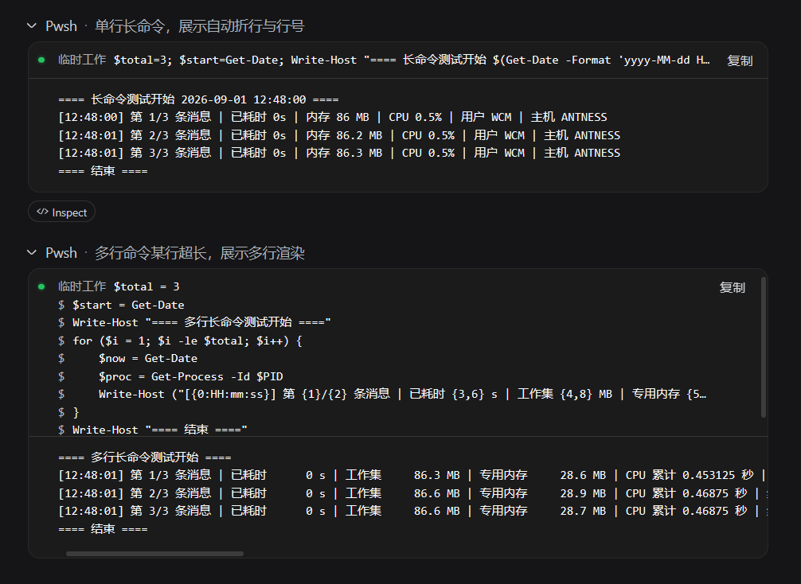
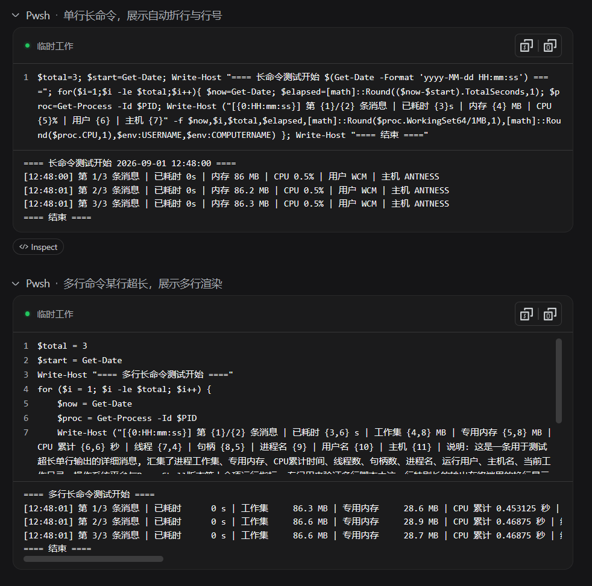

<p align="center"><a href="README.md">中文</a> | English</p>

# dsh-shell-card-plus

[](https://awesome-dsh-plugin.com)
[](#license)
[](https://github.com/deepseek-ai/deepseek-harness)

Enhanced command cards for bash / pwsh in the DSH web UI. Works out of the box; never touches how commands execute.

## What it fixes

The stock bash/pwsh card in DSH Web has two daily annoyances:

| Problem | Stock | This plugin |
|---|---|---|
| Long commands unreadable | Command is a single line, **truncated with an ellipsis** — anything past it is simply invisible | Command **soft-wraps** with line numbers, fully visible |
| No way to copy the command | Only a copy-output button exists; copying the command means manual text selection | Separate **copy command** and **copy output** buttons |

Status display follows the official convention: quiet when normal (just a status dot), a red `exit N` / `Signal X` pill only on failure.

<p align="center">
   
  <br>
  <sub><i>Left: stock expanded card · Right: this plugin's expanded card</i></sub>
</p>

## Features

- Fully replaces the official bash/pwsh tool row: the collapsed row keeps the official style; the expanded card is custom
  - **head**: status dot + cwd (subdirectory name) + copy-command / copy-output buttons
  - **command area**: full command, soft-wrapped with line numbers
  - **output area**: horizontal scroll, same reading habit as the original
- Only takes over bash/pwsh; other tools (read/write/search etc.) are untouched

## Install

```sh
# From npm (recommended — no allowBuilds setup needed)
dsh plugin --profile web add dsh-shell-card-plus

# From GitHub
dsh plugin --profile web add github:antnesswcm/dsh-shell-card-plus

# Or from a local directory
dsh plugin --profile web add ./dsh-shell-card-plus
```

Restart `dsh web` (or hard-refresh the browser, Ctrl+F5) after installing. Requires dsh ≥ 0.1.0-rc.5.

## How it works

Registers the `bash`/`pwsh` keys on the official `tool.call.toolview` slot to replace the official rendering of those tool rows. Command, cwd, output and exit status all come from the existing official ToolCallBlock data — the plugin is a pure presentation layer with no new events and no host changes. Implementation details: [CLAUDE.md](CLAUDE.md).

## Development

```sh
npm install
npm run build   # production build (lib/ is committed; users don't build)
npm run dev     # watch + hot reload
```

See [CLAUDE.md](CLAUDE.md) for development and handover docs.

## License

MIT
